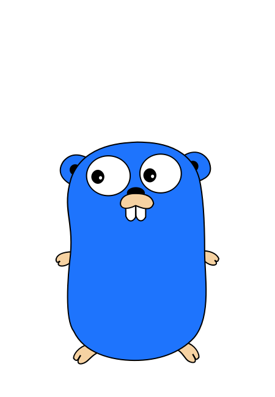

# Maisa Unbelievable 💕

<div align="center">

[](discordapp.com/users/888850239702859807)
[](https://github.com/EmilyGraceSeville7cf/EmilyGraceSeville7cf/blob/main/infos/qr-code-required.md)
[](https://signal.me/#eu/-xVbMeyDih_CE6JuCn-XuEtIbbXgv2H5M7WS7U_87KQeEycaT2hIiZYmFvuJVyAq)
[](https://github.com/EmilyGraceSeville7cf/EmilyGraceSeville7cf/blob/main/infos/no-profile-link-supported.md)
[](https://github.com/EmilyGraceSeville7cf/EmilyGraceSeville7cf/blob/main/infos/no-profile-link-supported.md)
[](https://fosstodon.org/@EmilySeville7cfg)
[](https://bsky.app/profile/emilyseville7cf.bsky.social)


**Discord** messenger is the recommended way to contact me, while **Bluesky**
to view my updates.
</div>

## About me

I am open source contributor and I am keen on administrating, scripting,
creating sites and presentations. It’s my life. I like to automate routine tasks
and not to do them manually. Currently I have the following skills (just the
most interesting tools are mentioned and some of their usages are explained):

- :computer: **programming, markup and configuration languages**:
  - `Fish` ([💬 community](https://matrix.to/#/#fish-shell:matrix.org) |
    [🛠️ favorites](https://github.com/stars/EmilyGraceSeville7cf/lists/fish-use)):
    automating tasks for developed tools
  - `TinyScheme` ([💬 community](https://discord.gg/mVYFqQWf) | [🖊️ scripts](https://github.com/EmilyGraceSeville7cf/tinyscheme-library-scripts)):
    extending GIMP
  - `Go` ([💬 community](https://discord.gg/GhxhQ4Jm) | [🛠️ tools](https://github.com/stars/EmilyGraceSeville7cf/lists/go-tools-use)):
    developing CLI, TUI and GUI applications
  - `JavaScript` ([💬 community](https://discord.gg/nm6VFEp2) | [🛠️ tools](https://github.com/stars/EmilyGraceSeville7cf/lists/javascript-tools-use)):
    developing VS Code extensions and Web Apps
  - `YAML` & `JSON`: configuration languages for `Go` applications
  - `Markdown`: explaining developed tools
- :memo: **ides and editors**:
  - `Visual Studio Code`: programming, writing tool explanations and
    configurations
  - `GIMP` & `Inkscape`: drawing images for developed tools
  - `OnlyOffice`: creating presentations about English and German
- :clock130: **vcs-tools**:
  - `Git` & `GitHub`: managing tool development

<div align="center">



</div>

## Placeholder syntax in my CLI tools 📖

Starting from 21 August 2024 I use the following placeholder syntax in all my
tools ([Go-inspired](https://pkg.go.dev/text/template)):

- `{{placeholder}}`: some arbitrary text with no constraints implied which
  should be exactly one CLI argument.
- `{{placeholder ...}}`: almost the same thing as the previous one, but here
  zero or more arguments are expected.
- `|` can be used inside double curly braces to provide more than one
  alternative for what can be placed instead of placeholder.

, where instead of `placeholder` any text can be written which explains what
should be put instead of CLI argument(s), but without spaces unless it's
explicitly permitted. This syntax is used just when no other default syntax is
mandated.

Examples:

```fish
command {{number}} # 1 number expected
command {{number..}} # 0 or more numbers expected
command {{number|strings...}} # one number or 0 or more string expected
```
